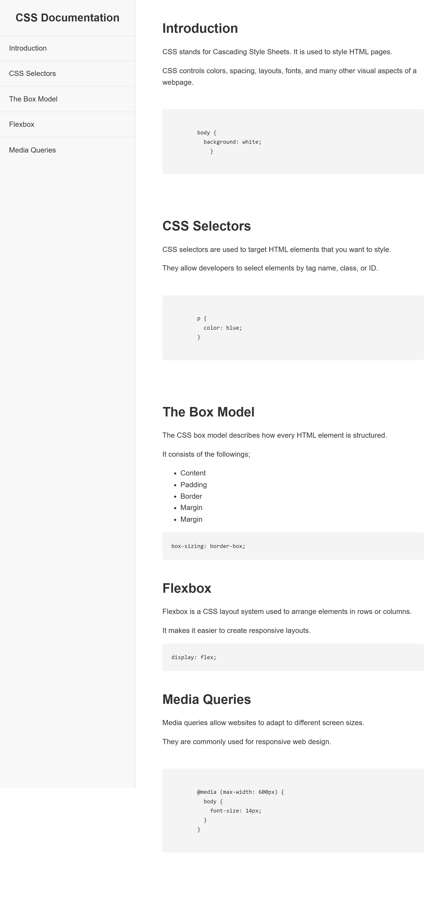

# Technical Documentation Page

A responsive **Technical Documentation Page** built with **HTML5** and **CSS3** as part of the freeCodeCamp Responsive Web Design Certification.

## 📖 Overview

This project demonstrates how to build a documentation website with a fixed navigation sidebar on desktop and a responsive layout for smaller screens.

Users can navigate through different sections using the navigation menu, and each link smoothly scrolls to the corresponding section.

---

## 🚀 Features

* Semantic HTML5 structure
* Fixed sidebar navigation (desktop)
* Responsive layout using Media Queries
* Smooth scrolling navigation
* Styled code blocks
* Hover effects on navigation links
* Mobile-friendly design

---

## 🛠️ Built With

* HTML5
* CSS3
* Flexibility through Responsive Design
* Media Queries

---

## 📚 What I Learned

While building this project, I gained a deeper understanding of:

* Semantic HTML elements (`<nav>`, `<main>`, `<section>`, `<header>`)
* Internal page navigation using `id` and `href`
* Fixed positioning with `position: fixed`
* Content spacing using `margin-left`
* Responsive web design with `@media`
* Creating user-friendly layouts for both desktop and mobile devices
* Structuring documentation pages for readability

---

## 📂 Project Structure

```text
.
├── Assets
|__ index.html
├── style.css
└── README.md
```

---

## 🎯 Project Goals

The goal of this project was to:

* Practice semantic HTML.
* Build a documentation page with internal navigation.
* Create a responsive user interface.
* Improve CSS layout and styling skills.
* Strengthen understanding of responsive design principles.

---

## 💡 Future Improvements

* Add a dark mode toggle
* Improve typography using Google Fonts
* Highlight the active navigation link while scrolling
* Add more documentation sections
* Include animations for a better user experience

---

## 📸 Preview



---

## 🔗 Live Demo

**Live Site:** https://technical-documentation-page-liard.vercel.app/

**Repository:** https://github.com/iamrakki03-eng/Technical-Documentation-Page

---

## 👨‍💻 Author

**Emuobonuvie Nyerhovwo Gabriel**

Learning in public and documenting my journey toward becoming a Front-End Developer.

Feel free to connect with me on LinkedIn and follow my progress as I continue building projects and improving my skills.

LinkedIn: https://www.linkedin.com/in/nyerhovwo-gabriel/
